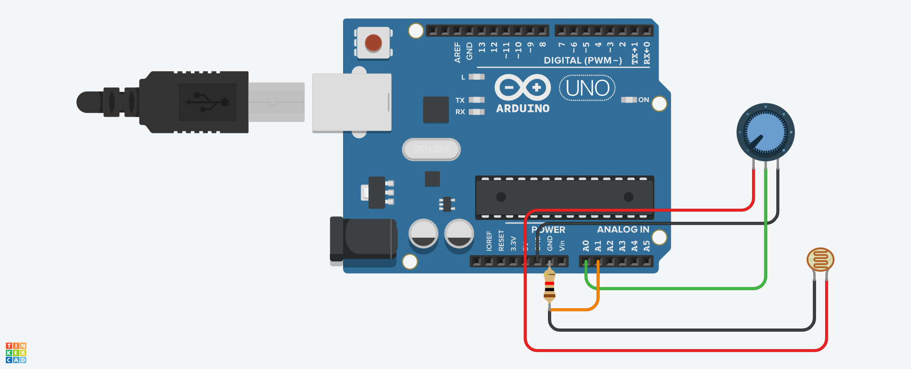

# Horta 2.0

Este projeto consiste num sistema de rega automático baseado num sensor de humidade do solo e um fotoresistor. Se o solo estiver abaixo de um certo nivel de humidade e o ambiente abaixo de um certo nivel de luminosidade, o sistema ativa uma válvula que rega a horta.

## Circuito

